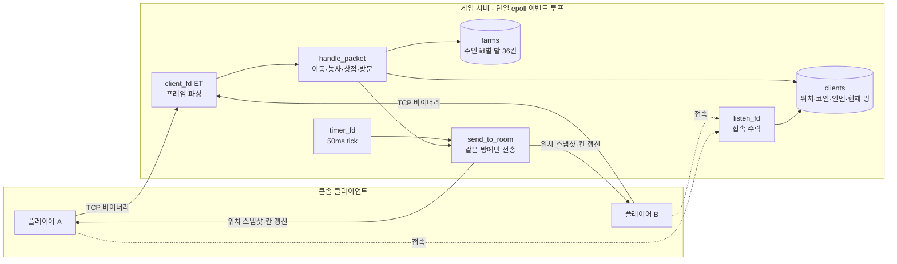

# 품앗이 (pumasi-server)

협동 농사 게임 서버. 각자 자기 농장을 가꾸고, 다른 사람 농장에 놀러 가서 밭을 갈아주고 물을 준다.
방문자가 준 물은 주인 화면에 바로 반영된다.

C++17 / Linux epoll 기반 server-authoritative 서버와 콘솔 클라이언트.

> **진행 중** — 코어 루프, 상점·인벤토리, 방·방문까지 완료. 채팅, DB 저장·로그인은 예정 ([로드맵](#로드맵))

## 화면

주인(`@`)이 순무를 심고 물을 준 칸(`T`) 옆에, 방문자(`P`)가 밭을 갈아준 칸(`=`)이 보인다.

```
. . . . . . . . . .
. . @ P . . . . . .
. . T = _ _ _ _ . .
. . _ _ _ _ _ _ . .
. . _ _ _ _ _ _ . .
. . _ _ _ _ _ _ . .
. . _ _ _ _ _ _ . .
. . _ _ _ _ _ _ . .
. . . . . . . . . .
. . . . . . . . . .

_: 맨땅 | =: 갈린땅 | t/c/p: 작물(마름) | T/C/P: 작물(젖음) | *: 작물 다 자람 | @: 나 | P: 다른 플레이어
```

## 게임 규칙

- 월드 10×10, 그 안에 밭 6×6. 칸은 `맨땅 → (갈기) → 갈린 땅 → (심기) → 자라는 중 → 다 자람 → (수확) → 맨땅`
- 물 1번에 1단계 자라고 다시 마른다. 마른 동안은 멈춘다.
- 씨앗은 상점에서 사고, 수확물은 상점에 판다. 시작 코인 100G.

| 작물 | 씨앗 | 판매 | 단계 | 단계당 시간 |
|---|---|---|---|---|
| 순무 | 10G | 20G | 2 | 30초 |
| 당근 | 30G | 75G | 3 | 60초 |
| 호박 | 100G | 300G | 4 | 150초 |

- 방문자는 갈기·심기·물주기를 할 수 있고, 수확은 주인만 한다. 방문자가 자기 씨앗으로 심어주면 열매는 주인이 가져간다.
- 방문자가 남의 작물에 물을 주면 +2G.

## 기술 스택

- C++17, Linux (epoll, timerfd)
- 길이 접두사 바이너리 TCP 프로토콜
- 콘솔 클라이언트 (raw 터미널 입력)

## 아키텍처



## 설계 결정 & 트레이드오프

### 1. 작물 성장은 지연 계산 — 작물마다 타이머를 두지 않는다
- 칸은 `단계`와 `마지막으로 물 준 시각(watered_at)`만 저장한다. 성장은 저장하는 사건이 아니라, 필요할 때 `watered_at`과 현재 시각으로 계산하는 값이다.
- 서버는 그 칸에 행동 요청이 오거나 밭 전체를 보낼 때만 계산(`refresh`)해서 반영한다. 30초에 한 번 바뀌는 값을 50ms마다 모든 칸을 훑어 확인할 필요가 없다.
- 같은 계산이 저장·로드에도 그대로 쓰인다. 저장이 붙으면(05·06) 주인이 접속해 있지 않은 동안의 성장도 추가 코드 없이 처리된다.

### 2. 판정은 서버, 표시는 클라가 같은 공식으로
- 서버는 성장을 따로 알리지 않는다. 클라는 서버가 준 `watered_at`과 작물 표로 "지금쯤 몇 단계인지"를 스스로 계산해 그린다.
- 클라 시계와 서버 시계는 다를 수 있어서, 방에 들어갈 때 받은 서버 시각과 자기 시계의 차이를 기억해 두고 환산한다.
- 클라의 계산은 표시용일 뿐이다. 수확 같은 요청은 서버가 자기 시계로 다시 계산해서 판정한다.
- 화면을 그리는 함수는 상태를 바꾸지 않는다. 저장된 칸 값은 서버가 준 그대로 두고, 표시용 계산은 복사본에서 한다.

### 3. 방 = 농장
- 농장은 `Client` 안이 아니라 별도 맵(`farms`, 키 = 주인 id)으로 둔다. 농장은 방문자도 읽고 쓰는 공유 자원이고, 나중엔 주인 접속과 무관하게 살아 있어야 해서 수명을 분리했다.
- `Client`는 지금 어느 농장에 있는지(`current_farm`)만 들고 있다. 위치 스냅샷과 칸 갱신은 같은 방 사람에게만 보낸다.
- 농사 패킷에는 대상 농장 id를 담지 않는다. 서버가 `current_farm`으로 이미 알고 있고, 담으면 들어가 있지도 않은 농장을 조작하는 요청을 따로 막아야 한다.
- 칸 갱신은 성공하면 방 전원에게, 거부되면 요청자에게만 보낸다. 거부는 칸이 바뀌지 않았으니 다른 사람이 받을 이유가 없다.
- 주인이 나가면 그 농장에 있던 방문자는 각자 자기 농장으로 돌려보낸다.

### 4. 무시 vs 거부
기준은 "정상 클라가 보낼 수 있는 요청인가"다.
- **무시 (응답 없음)**: 정상 클라가 만들 수 없는 요청. payload 크기 불일치, 밭 밖 좌표, 없는 작물 번호.
- **거부 (현재 상태를 돌려줌)**: 정상 클라도 타이밍 때문에 보낼 수 있는 요청. 너무 먼 칸, 상태가 안 맞는 칸(젖은 칸에 물 등), 방문자의 수확, 씨앗 부족. 그 칸의 현재 값을 돌려보내 클라 화면이 어긋나 있었다면 바로잡는다.

### 5. 바이너리 프로토콜
- `[length:2][type:2][payload]` 길이 접두사 프레이밍, 빅엔디안.
- 패킷 번호를 대역으로 묶었다. 10번대 농사 요청, 20번대 밭 알림, 30번대 경제 요청, 40번대 경제 알림, 50번대 방문 요청, 60번대 방문 알림.

## 패킷

| 번호 | 이름 | 방향 | payload |
|---|---|---|---|
| 2 | MOVE | 클라→서버 | `[dx:1][dy:1]` |
| 3 | SNAPSHOT | 서버→클라 | `[count:2]` + count×`[id:4][x:4][y:4]` — 같은 방 위치, 매 tick |
| 4 | WELCOME | 서버→클라 | `[id:4]` — 접속 직후 |
| 10~13 | TILL / PLANT / WATER / HARVEST | 클라→서버 | `[x:1][y:1]` (PLANT만 `[crop:1]` 추가) |
| 20 | TILE_UPDATE | 서버→클라 | `[x:1][y:1][state:1][crop:1][stage:1][watered_at:8]` |
| 21 | FARM_SNAPSHOT | 서버→클라 | `[owner_id:4][server_now:8]` + 36칸×`[state:1][crop:1][stage:1][watered_at:8]` — 방 입장 시 |
| 30 / 31 | BUY / SELL | 클라→서버 | `[crop:1][count:1]` |
| 40 | WALLET | 서버→클라 | `[coin:4]` + 작물별 `[seeds:1][held:1]` |
| 50 | VISIT | 클라→서버 | `[owner_id:4]` — 내 농장으로 = 내 id |
| 51 | CHAT | 클라→서버 | 메시지 바이트(UTF-8), 최대 200바이트 |
| 60 | PLAYER_LIST | 서버→클라 | `[count:2]` + count×`[id:4]` — 접속·퇴장 시 전원 |
| 61 | CHAT_MSG | 서버→클라 | `[sender_id:4]` + 메시지 바이트 — 같은 방 전원 |

## 빌드 & 실행

```bash
g++ -std=c++17 -O2 -o game_server src/game_server.cpp
g++ -std=c++17 -O2 -o client src/client.cpp

./game_server   # 포트 9000
./client        # 다른 터미널에서. 여러 개 띄우면 여러 명
```

조작 (행동 대상 = 바라보는 앞 칸)

| 키 | 동작 |
|---|---|
| `w` `a` `s` `d` | 이동 (마지막 이동 방향을 바라봄) |
| `t` / `1` `2` `3` / `e` / `r` | 갈기 / 심기(순무·당근·호박) / 물 / 수확 |
| `b` | 상점: `1` `2` `3` 씨앗 사기, `Shift`+`1` `2` `3` 수확물 팔기, `b` 닫기 |
| `v` | 방문: 번호로 농장 선택, `h` 내 농장으로, `v` 닫기 |
| `q` | 종료 (상점·방문 창에서는 닫기) |

## 테스트

```bash
g++ -std=c++17 -o farm_test src/farm_test.cpp && ./farm_test          # 칸 상태 전이 전 조합, 성장 계산
g++ -std=c++17 -o protocol_test src/protocol_test.cpp && ./protocol_test  # u64 직렬화 왕복
```

아무것도 출력되지 않고 종료되면 통과.

## 설계 문서

조각마다 상태·패킷·검증 규칙을 반 페이지로 먼저 쓰고 구현했다.

- [scope.md](docs/scope.md) — 전체 스코프, 완료 기준
- [01-core-loop.md](docs/01-core-loop.md) — 칸 데이터, 상태 전이, 시간 계산, 패킷, 서버 검증
- [02-shop-inventory-coin.md](docs/02-shop-inventory-coin.md) — 코인·인벤토리, 상점
- [03.md](docs/03.md) — 방·방문·소유권

## 로드맵

- [x] 코어 루프 (갈기·심기·물·성장·수확)
- [x] 상점·인벤토리·코인
- [x] 방·방문·방 단위 동기화
- [x] 채팅
- [ ] Unity 클라이언트
- [ ] DB 저장·로그인 (DB 호출은 워커 스레드로 분리)
- [ ] 주인이 오프라인인 농장 방문 (DB 로드/언로드)
- [ ] 봇 부하 테스트·데모 영상

현재는 접속이 끊기면 그 사람 농장이 사라진다(저장 전).